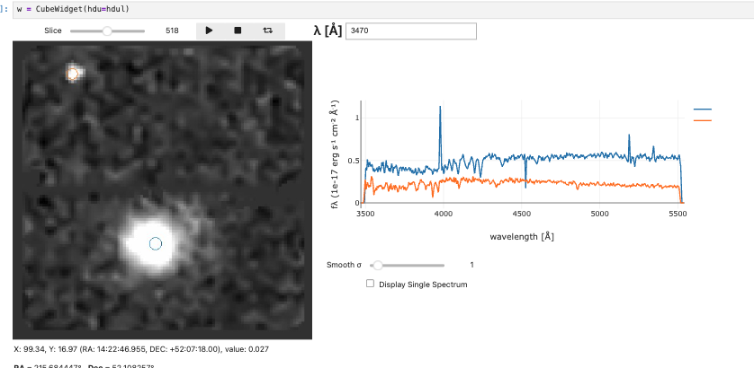

# 🌌 HETDEX Public Data Release — Cube Tutorial



Welcome to **dexcube**: a hands-on set of Jupyter notebooks that teach you how to *find, download, and analyse* the 3-D IFU (Integral Field Unit) datacubes in the HETDEX Public Data Release (PDR 1).

These notebooks are meant to be opened sequentially – each one builds on the skills and files created in the previous step. In a couple of hours you will go from an empty working directory to:

- a local subset of PDR cubes  
- interactive visual exploration of flux, variance and metadata  
- extraction of 1-D spectra and emission-line measurements  
- access to the official HETDEX Source Catalog  
- quick source look-up and cross-matching to external catalogues  
- scaling up to batch downloads and large-catalog extractions  

---

## 🗂 Notebook Guide

| Order | Notebook                                   | What it covers                                     | Key take-aways                                                                                                  |
| ----- | ------------------------------------------ | -------------------------------------------------- | --------------------------------------------------------------------------------------------------------------- |
| 01    | **01-DataModel+IFU-Index.ipynb**           | PDR data model & the master IFU index FITS file    | Understand cube filenames, sky coverage and the columns you will use for programmatic searches.                 |
| 02    | **02-DownloadingCubes.ipynb**              | Authenticating and fetching cubes in bulk          | How to download and decompress FITS cubes.                                                                      |
| 03    | **03-DataCubeFormat.ipynb**                | Anatomy of a single cube                           | What’s in the 3 HDU extensions (DATA, ERROR, BITMASK); units; header keywords.                                  |
| 04    | **04-MaskingOptions.ipynb**                | Quality & science masks                            | Build boolean masks from BITMASK bits.                                                                          |
| 05    | **05-CubeWidget.ipynb**                    | Interactive exploration                            | A lightweight `CubeWidget` for browsing xyλ slices, clicking spaxels to see spectra, adjusting display scaling. |
| 06    | **06-CoordinateQuery.ipynb**               | Sky-coordinate searches                            | Given an RA/Dec list, locate covering cubes/IFUs, open them, and overlay reference catalogues.                  |
| 07    | **07-CollapsingCubes.ipynb**               | Creating 2-D images                                | Collapse along wavelength to make white-light or narrow-band maps; write the result as a FITS image.            |
| 08    | **08-ExtractingSpectra.ipynb**             | 1-D spectral extraction                            | Example 1D spectral extraction, continuum subtraction and per-pixel error propagation.                          |
| 09    | **09-CatalogExtractions.ipynb**            | Batch 1D extractions from a source catalog         | Extract spectra on many cubes, compile an Astropy Table, and save as ECSV/FITS.                                 |
| 10    | **10-HETDEX-Source-Catalog.ipynb**         | Exploring the HETDEX source catalog                | Learn the structure of the official catalog and how to cross-match to your extractions.                         |
| 11    | **11-Source-Look-Up.ipynb**                | Quick source look-up                               | Given coordinates or IDs, locate and open corresponding sources/cubes.                                          |
| 12    | **12-BatchDownloads-ForRemoteUsers.ipynb** | Scaling up for remote users                        | Download and stage multiple cubes efficiently for offline analysis.                                             |

> **Tip** Open the notebooks in JupyterLab and *Run All* one at a time. A small test cube is fetched automatically so you can experiment even without full-survey access.

---

## ⚡ Quick Start outside the public Jupyter Hub

```bash
# 1) clone & install
$ git clone https://github.com/HETDEX/dexcube.git
$ cd dexcube
$ pip install -r requirements.txt
